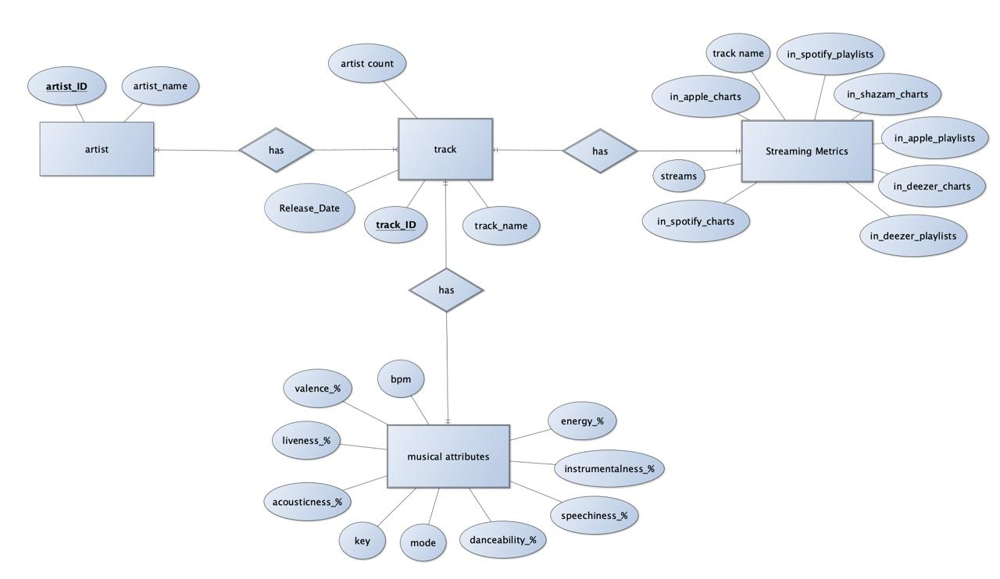
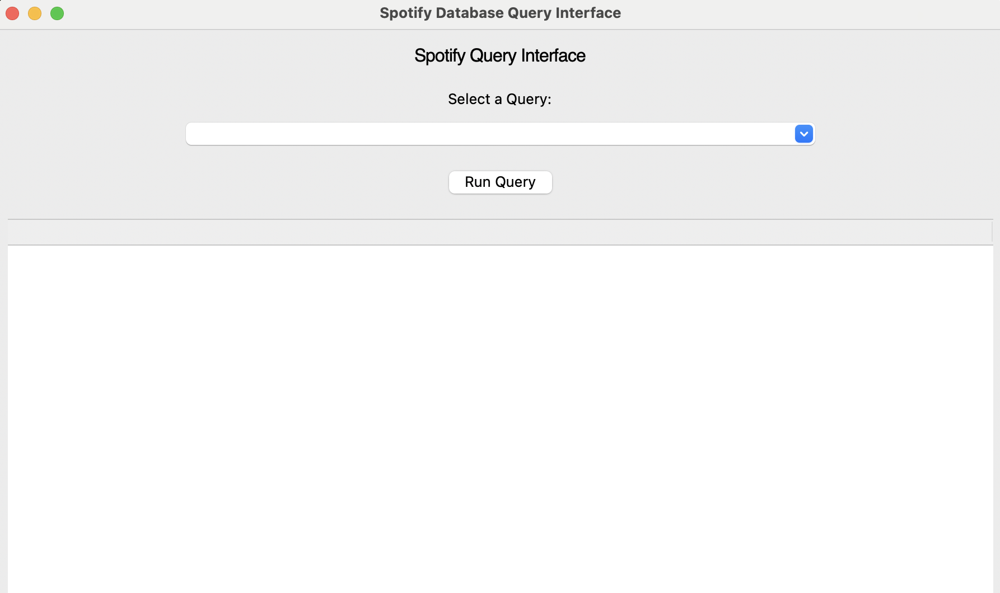
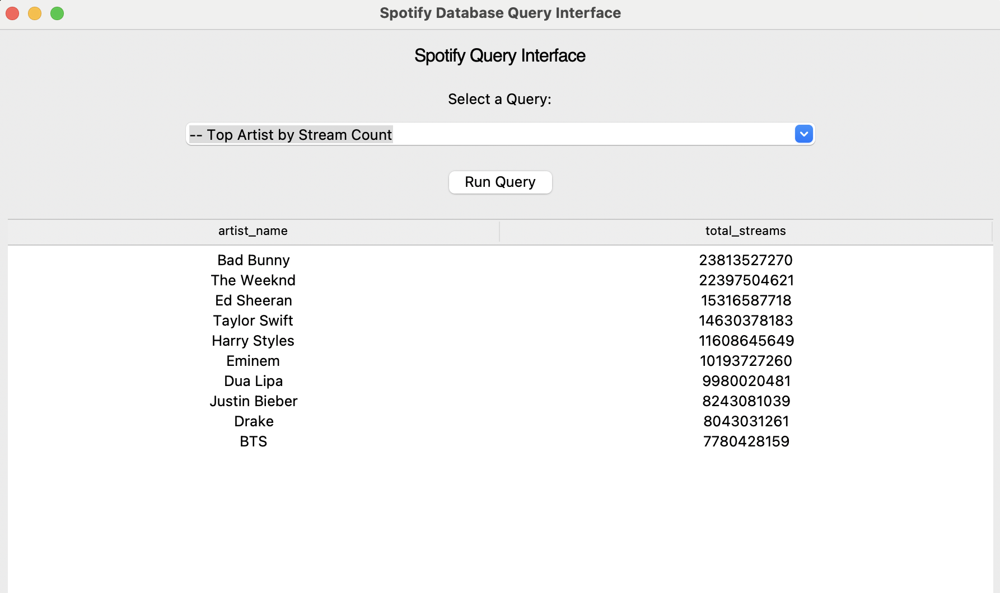
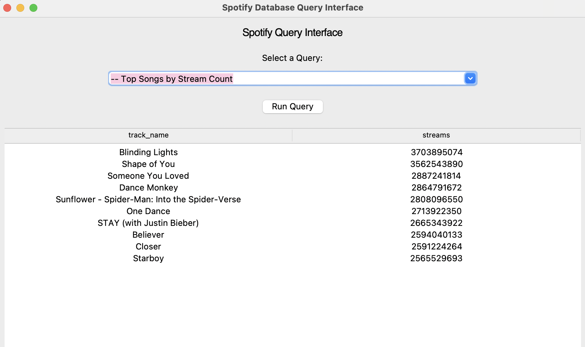
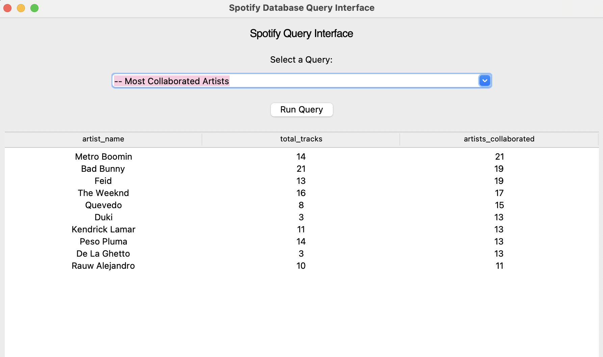
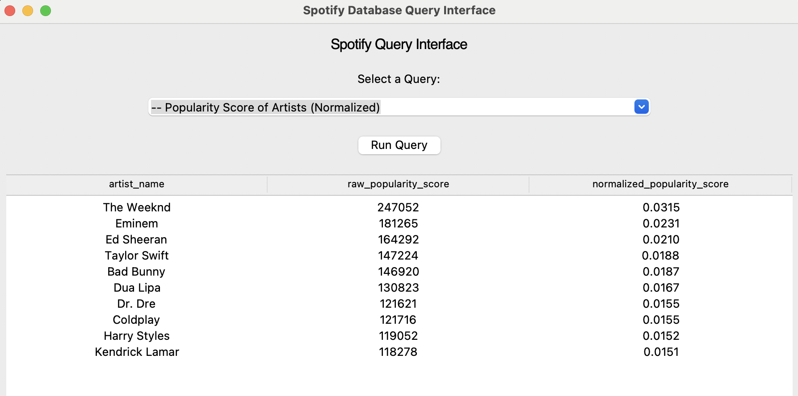

# Spotify Most Streamed Songs — Relational Database Project

This project designs, builds, and demonstrates a complete relational database system for the **Spotify Most Streamed Songs** dataset.  
It includes:

- A fully normalized **MySQL database schema**
- A **Python data loader** that cleans and inserts data into the database
- A **Tkinter user interface** for running analytical SQL queries interactively
- A full **ER Diagram** representing the database structure

## Overview

This project analyzes trends and characteristics of globally streamed songs using a custom relational database.

### The pipeline includes:

### **1. Database Schema (MySQL)**  
Defined in `spotify_database.sql`, consisting of:

- `Artist`  
- `Track`  
- `Artist_Track` (many-to-many join table)  
- `StreamingMetrics`  
- `MusicalAttributes`

### **2. Data Cleaning & Loading (Python)**  
`data_loading.py`:

- Cleans numeric fields (streams, playlists, BPM, etc.)
- Removes problematic rows
- Formats release dates 
- Inserts artists, tracks, and attributes efficiently
- Uses in-memory caching to avoid redundant queries

### **3. Query Interface (Tkinter GUI)**  
`interface.py`:

- Connects to the MySQL database  
- Provides a dropdown with predefined SQL queries:
  - Top artists by streams  
  - Top songs  
  - Most collaborated artists  
  - Most playlist appearances  
  - Most charted artists  
  - Normalized popularity score  
  - Top acoustic tracks  
  - Most streamed tracks per year  
  - Average danceability/energy  
  - Minimum speechiness  
- Displays results in a scrollable table  
- Friendly, interactive, and easy to use  

### **4. ER Diagram**  
Located in the `diagrams/` folder




## Installation & Setup

### **1. Clone the repository**
```bash
git clone https://github.com/assima0/Spotify-Database-Project.git
cd Spotify-Database-Project
```

## **2. Install dependencies**

```pip install -r requirements.txt```

## **3. Set up MySQL database**
Run the SQL schema: 
```mysql -u root -p < sql/spotify_database.sql```
This creates the database spotify_project and all required tables and relationships.

## **4. Add your database configuration**
The project uses a private config.py file (not included in GitHub).
Do this to create a configuration file:

1. Duplicate src/config_example.py

2. Rename it to config.py

3. Fill in your own MySQL credentials:
```bash
import os
DB_HOST = "localhost"
DB_PORT = 3306
DB_USER = "root"
DB_PASSWORD = "your_mysql_password"
DB_NAME = "spotify_project"
```
## **5. Data Loading**
Make sure your CSV dataset is placed in right path: data/Spotify Most Streamed Songs.csv

Then run: 
```python src/data_loading.py```
This script will clean the dataset and load artists, tracks, metrics, and attributes into MySQL. 

## **6. Running the Query Interface**
```python src/interface.py```

You will see a Tkinter window with:
- A dropdown menu of SQL queries
- A button to execute
- A table showing results

## Results

Below are some screenshots demonstrating the functionality of the Spotify Database Query Interface, as well as examples of the insights generated by our SQL queries.
More detailed results are discussed in "Spotify_Project" presentation file.  

**Main Interface Window**

This is the user interface built with Tkinter, allowing selection of predefined SQL queries from a dropdown menu and displaying results in a table view.



Below are some examples of queries:

1. Top Artists by Stream Count

This query aggregates total streams across all tracks for each artist.
It helps identify the most dominant streaming artists globally.

Insight:
Artists like The Weeknd, Taylor Swift, Drake, and Ed Sheeran typically top the list due to having multiple high-streaming hits.



2. Top Songs by Stream Count

Shows the highest-streamed tracks in the dataset.

Insight:
Tracks such as Blinding Lights, Shape of You, and Heat Waves often appear among the most streamed songs due to their longevity in playlists and charts.



3. Most Collaborated Artists

This query counts how many distinct collaborators each artist has worked with.



4. Popularity Score of Artists (Normalized)

This query measures how popular each artist is across all platforms by combining their appearances in:

- Spotify playlists & charts
- Apple Music playlists & charts
- Deezer playlists & charts
- Shazam charts

These values are summed to create a raw popularity score for each artist.
To make the scores comparable, each raw score is divided by the total popularity of all artists, producing a normalized popularity score between 0 and 1.
This shows which artists dominate overall relative to everyone else.



These examples highlight how the database enables efficient analysis of artist activity, collaborations, popularity, and streaming performance across platforms.

## License
This project is for educational purposes only.
